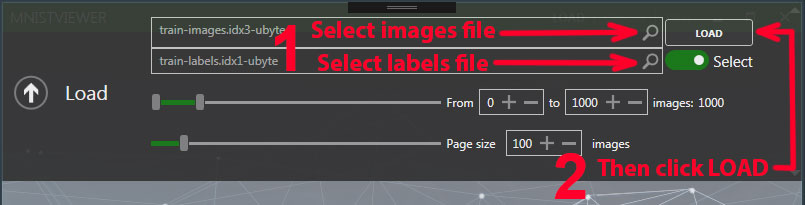
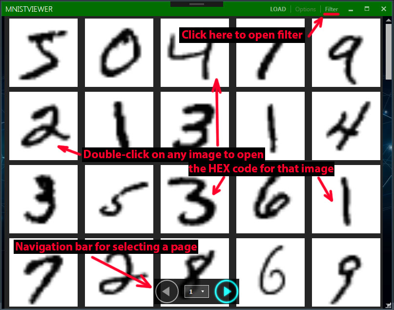
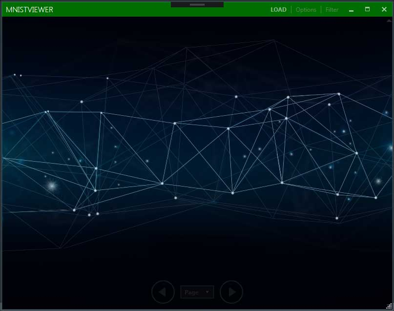
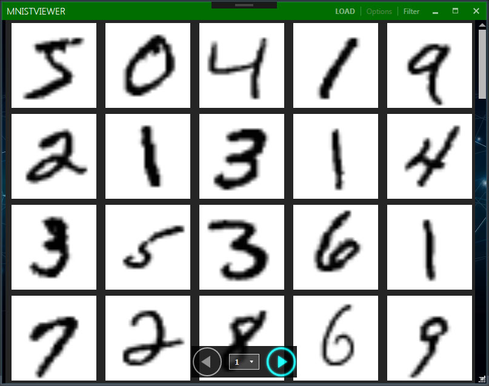
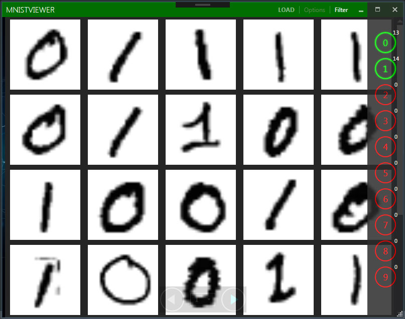
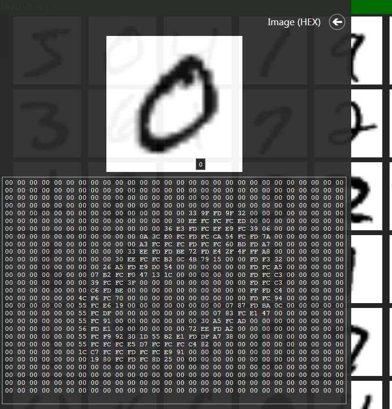

# MNIST-Viewer

This program (in C#) is a WPF application (using MVVM pattern) for viewing images, downloaded from the [MNIST](https://en.wikipedia.org/wiki/MNIST_database) handwritten digit database. The program reads the MNIST dataset (images and labels) and displays it in a convenient form with the ability to navigate and filter. You can find detailed information about the MNIST data structure and download the original dataset [here](http://yann.lecun.com/exdb/mnist/). In this program, the MNIST dataset is already loaded and stored in the Data directory. **The application is not completed and is under development**.

## How To Use

### Step 1

- Build this project, using the **Solution Explorer -> Build Solution** by right-clicking on the **Solution Explorer**.

### Step 2

- Run the created executable file (**MNIST_Viewer.exe**).

### Step 3

- Load the MNIST dataset into the program by clicking on **LOAD**.

### Step 4

- Select the MNIST dataset (image and label files). Here you can configure data loading: from which and to which digit to read dataset and how much to display on the page.

### Step 5

- The main window of the program after loading the MNIST dataset is shown in the figure below.

## Libraries and integrated tools

Used for the GUI. Special thanks to:

- [MahApps.Metro](https://github.com/MahApps/MahApps.Metro)
- [ControlzEx](https://github.com/ControlzEx/ControlzEx)

## Screenshots

## Licence

[MIT License](https://github.com/artgl42/MNIST-Viewer/blob/master/LICENSE) Copyright (c) 2020 Artem Glushkov
